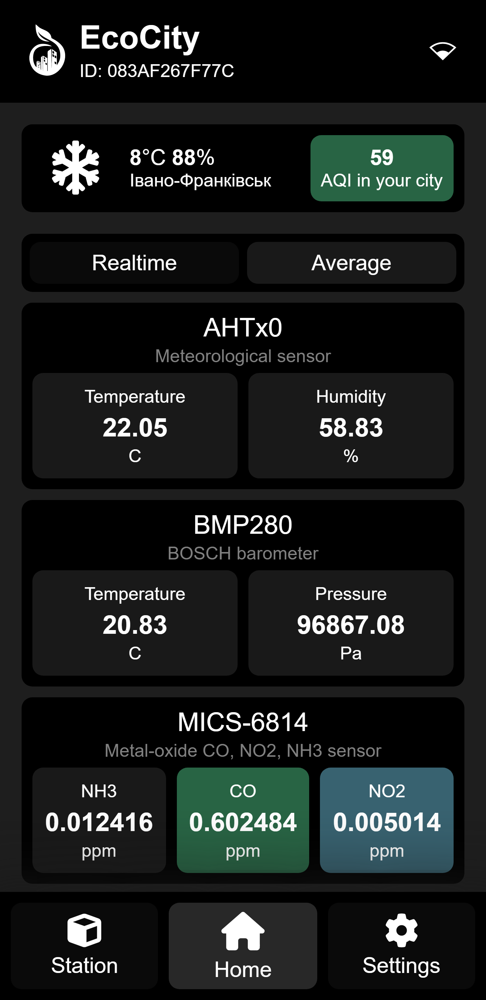
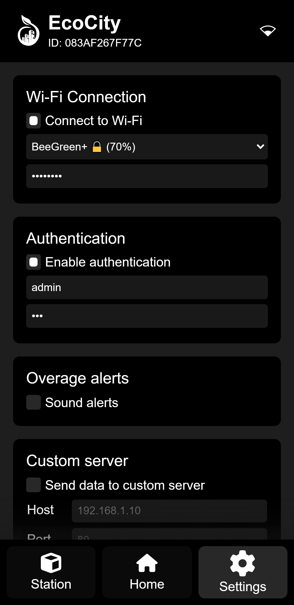

# EnvironmentFace
> ⚠ *Under active development* ⚠

Frontend for new interface of EnvironmentOS. 

In fact, this is already the third variation of the EnvironmentOS interface. The basis of the frontend is a set of static files that will be stored in the flash memory of the device. The server does not process these files in any way, but simply sends them on request.

Pages become dynamic thanks to JS scripts that download data via XMLHttpRequest. The server responds with JSON files containing various data. In this version I plan to make the entire user interface single-page. Thus, all necessary resources will be downloaded only once when opening the page and the user will not have to wait for downloads.

The scripts are written on pure JS, to save memory and make the interface work faster.

## Features 
* Responsive design
* Single page user interface
* Live values updating
* Service pages for configuration 
* Showing banner when host is offline

## Screenshots

<!-- | Info page | Home page | Settings page |
|:---------:|:---------:|:---------:|
|||| -->

<table width="100%">
  
  <tr>
  <td width="33%"></img></td>
  <td width="33%"></img></td>
  <td width="33%"></img></td>
  </tr>

  <tr>
  <td>Info</td>
  <td>Home</td>
  <td>Settings</td>
  </tr>

</table>

## Used resources 
* [Material Icons](https://fonts.google.com/icons) by Google
* Some icons from [FontAwesome](https://fontawesome.com/)

## Licensing 

Copyright © 2023 Dmytro Obukhov (DeLy Dreamer)
 
This program is free software: you can redistribute it and/or modify it under the terms of the **GNU General Public License** as published by the Free Software Foundation, either version 3 of the License, or (at your option) any later version.

This program is distributed in the hope that it will be useful, but without any warranty; without even the implied warranty of merchantability or fitness for a particular purpose. 
 
See the [GNU General Public License](/LICENSE) for more details.